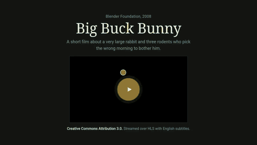
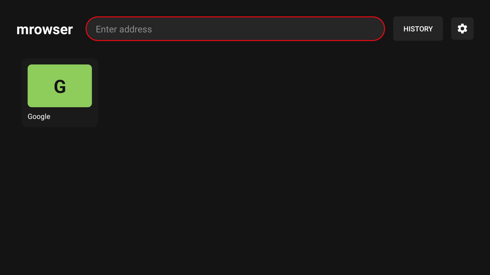
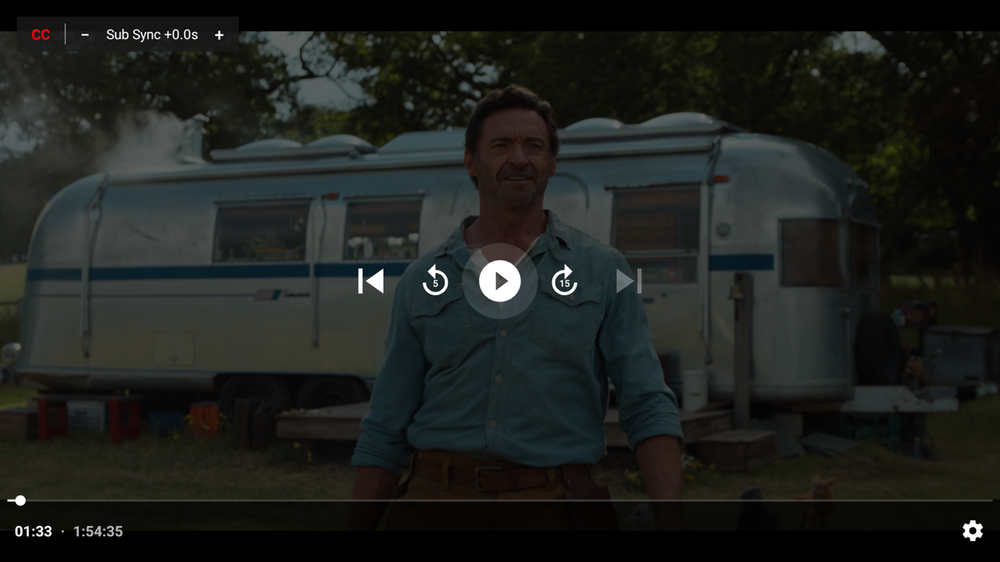

# mrowser — Android TV Browser for Streaming Video

> A sideload-only **Android TV browser** for **watching video from websites your TV has no app for**. It detects the page's **HLS stream** automatically and plays it in a proper native **Media3 / ExoPlayer** player — correct **A/V sync**, quality and audio-track selection, and **subtitles you can retime while watching** — with a **D-pad-driven virtual mouse cursor** to get you there from the remote. No Google Play Services required.

<!-- Badges: update the owner/repo path once the repository is public. -->
[](https://github.com/m-salehi-v/mrowser/actions/workflows/build.yml)
[](LICENSE)
[](https://github.com/m-salehi-v/mrowser/releases)
[](#requirements)

---

## What is mrowser?

**mrowser** (`net.mrowser`) is a lightweight, open-source **smart TV web browser** built specifically for **Android TV** and the **D-pad remote**. Its point is **streaming video from sites the TV has no app for**: open a site, start its video, and mrowser hands the stream to a real player instead of the WebView — so a whole film stays in sync. Everything else in the app exists to make that possible from a remote.

> **mrowser hosts no content and breaks no DRM.** It ships with no preset sites or bookmarks, and it only replays standard HLS streams that the page you are visiting has already loaded in your own browser session — DRM/Widevine-protected content stays in the WebView. See [Scope of use & disclaimer](#scope-of-use--disclaimer).

### The problem it solves

Watching video on Android TV means **whatever apps the store carries**. A site with the video you want and no app to match is effectively unreachable:

- Most TV apps are walled gardens. There is no good way to just *open a website* and watch its video.
- The handful of TV browsers that exist play video **inside the WebView**, whose built-in player gives **poor audio/video sync** — lips drift, audio lags, subtitles slip.
- Websites assume a mouse and a touchscreen. A **D-pad remote** can't click links, hover menus, or hit a tiny play button.

mrowser fixes all three:

1. **Find the real stream automatically.** As you browse, mrowser **sniffs the page's network traffic for an HLS manifest** (`.m3u8`) — an in-app **HLS sniffer** — and surfaces a play chip the moment a video stream appears. HLS is what most streaming sites use; see the [FAQ](#faq) for what is not covered.
2. **Play it properly.** The stream is handed to a **native Media3 / ExoPlayer** activity — with the session's User-Agent, Referer and cookies attached so it keeps working — for **correct A/V sync**, quality / audio-track selection, and **live, nudgeable subtitle timing**. Not the WebView's player.
3. **Get there with a D-pad.** A **virtual mouse cursor** is driven entirely by the remote's directional pad and OK button, so any mouse-and-pointer website becomes navigable from the couch.

### What it is optimized for

- **Streaming video from ordinary websites** — the whole pipeline, from sniffing the page's HLS manifest to native playback, exists for this.
- **Correct A/V sync** via native ExoPlayer instead of the WebView player, so a two-hour film does not drift.
- **Side-loaded subtitle support** (VTT and SRT) with a **live timing nudge** (±0.5s per press) — fix out-of-sync subtitles without rebuffering.
- **Android TV and D-pad remotes** — no touchscreen, no mouse, no keyboard assumed.
- **Low-power TV hardware** — plain Kotlin, framework `Activity` + XML layouts, **no AndroidX/Compose** beyond Media3, single Gradle module.
- **No Google Play Services** — fully sideload-only; works on de-Googled and minimal Android TV builds.

---

## Demo



*Home screen → an ordinary page with an HLS video → the stream is detected (note the **Play synced** chip) → automatic handoff to the native Media3 player, with subtitles rendered by the app. Recorded on the Android TV emulator against a local HLS test page (Big Buck Bunny, Creative Commons).*

---

## Screenshots

| Home screen | Native player with live subtitle sync |
| --- | --- |
|  |  |
| D-pad-friendly launcher: address bar, favorites grid, History and Settings. | Stream handed off to Media3/ExoPlayer; the top-left **sub-sync box** toggles subtitles and nudges their timing (±0.5s) live — no rebuffer. |

---

## Features

- **D-pad mouse cursor** — a remote-driven virtual pointer (`CursorLayout` + `CursorController`) for sites a remote normally can't navigate; adjustable cursor speed.
- **Automatic HLS detection and handoff** — the browser sniffs every WebView request, classifies media URLs, and auto-opens the stream in the native player when one appears (toggle off if you prefer a manual play chip).
- **Native Media3 / ExoPlayer playback** — correct **A/V sync**, with in-player **quality**, **audio-track**, and **playback-speed** selection in the player's settings gear.
- **Live subtitle sync** — the app renders side-loaded subtitles itself (VTT **and** SRT) so you can nudge their timing **±0.5s per press** (clamped to ±30s) **instantly, with no rebuffer** — solving the classic "subtitles are a second behind" problem ExoPlayer can't fix live.
- **Smart subtitle labelling** — side-loaded tracks carry no language metadata, so mrowser infers a readable name (English, Persian, …) from the subtitle URL, else a generic `Subtitle N`.
- **Home screen with favorites** — a favorites grid; add/remove the current page with the ★ button.
- **Browsing history** — newest-first, deduplicated, with relative "Nm ago" labels; long-press to favorite.
- **Global settings** — auto-open-player toggle and cursor-speed picker, applied live with no restart.
- **Fullscreen HTML5 video** support in the WebView for sites that need it.
- **D-pad chrome bar** — address bar summoned with **MENU**, with URL normalization.
- **Netflix-style dark UI**, brand red `#E50914`.
- **Sideload-only, no Google Play Services**, `minSdk 23`.

---

## How it works

The core pipeline is **browse → sniff → handoff → play**:

```
WebView (D-pad cursor)
   │  every resource request
   ▼
SniffingWebViewClient ──▶ StreamSniffer ──▶ MediaUrlClassifier
   │                         (off UI thread)   (.m3u8 → HLS, .vtt/.srt → subtitle)
   │  first HLS manifest
   ▼
onStreamAvailable ──▶ play chip + automatic handoff
   │
   ▼
bestRequest()  (StreamCandidateSelector picks manifest + subtitle tracks,
   │            attaches User-Agent / Referer / Cookie headers)
   ▼
HandoffController ──▶ serializes PlaybackRequest ──▶ PlayerActivity
                                                       (Media3/ExoPlayer + app-rendered subtitles)
```

1. **Browse.** You drive a virtual mouse cursor with the D-pad over a normal `WebView`.
2. **Sniff.** `SniffingWebViewClient` forwards every resource request to `StreamSniffer`, which classifies each URL with the pure `MediaUrlClassifier` (extension-based: `.m3u8` → HLS, `.vtt`/`.srt` → subtitle) and accumulates candidates.
3. **Handoff.** On the first HLS manifest, a play chip appears and (unless auto-open is off) `HandoffController` serializes a `PlaybackRequest` — manifest + subtitle tracks + playback headers — and launches `PlayerActivity`.
4. **Play.** ExoPlayer plays the HLS stream with correct A/V sync. **BACK returns to the browser** (the WebView pauses during playback). Subtitles are **rendered by the app, not the player**, so a ~150ms ticker can push cues at `currentPosition + offset` into the `SubtitleView` — which is why the **sub-sync box** can nudge timing live.

Throughout, **pure decision/parsing/geometry logic is separated from Android glue** so it can be unit-tested on the JVM without a device (`MediaUrlClassifier`, `StreamCandidateSelector`, `SubtitleCueParser`, `ActiveCueFinder`, `CursorGeometry`, and more).

---

## Installation (sideload on Android TV)

mrowser is **sideload-only** — it is not on the Play Store and needs no Google Play Services.

1. Download the latest `app-release.apk` from the [**Releases**](https://github.com/m-salehi-v/mrowser/releases) page.
2. Get the APK onto your Android TV device using any of:
   - a USB stick + a file manager app, or
   - a sideloading helper app (e.g. "Send files to TV" / "Downloader"), or
   - `adb install app-release.apk` from a computer.
3. When prompted, allow **install from unknown sources** for the installer app.
4. Launch **mrowser** from the Android TV launcher (it registers as a Leanback launcher app).

No ADB is strictly required — copying the APK to the device and opening it works.

### Automatic updates with Obtainium

[Obtainium](https://github.com/ImranR98/Obtainium) installs apps directly from GitHub Releases and keeps them updated — no store account, no Play Services. Add mrowser as an app source with this URL:

```
https://github.com/m-salehi-v/mrowser
```

---

## Usage / remote controls

mrowser is driven entirely by a standard **D-pad remote** (directional pad + OK + BACK, plus MENU where the remote has one).

| Control | Action |
| --- | --- |
| **D-pad arrows** | Move the virtual mouse cursor (with acceleration and edge detection) |
| **OK / Center** | Click at the cursor position |
| **OK long-press** | Toggle between **CURSOR** mode (free pointer) and **FOCUS** mode |
| **MENU** *or* **BACK long-press** | Open the chrome / address bar to type or navigate a URL. Many TV remotes (e.g. the Mi Box 4K) have no MENU key — hold BACK for 500ms instead. |
| **BACK** (tap) | Step back: chrome bar → WebView history → "Close this page?" → home |
| **★ (favorite button)** | Add/remove the current page to favorites |

In the **native player**:

| Control | Action |
| --- | --- |
| **BACK** | Return to the browser (re-enter later via the play-synced chip) |
| **Settings gear** | Quality / Audio track / Playback speed |
| **CC button** (sub-sync box, top-left) | Toggle subtitles on/off and pick a track |
| **`[−]` / `[+]`** (sub-sync box) | Nudge subtitle timing by ±0.5s (live, no rebuffer) |

The **home screen** offers a favorites grid, a URL entry, browsing **History**, and **Settings** (auto-open-player toggle, cursor speed).

> For the full, authoritative control scheme and edge cases, see the milestone specs and plans in [`docs/superpowers/`](docs/superpowers/).

---

## Building from source

**Toolchain:** JDK 17 · AGP 9.1.1 (built-in Kotlin) · Gradle 9.3.1 · `compileSdk 36` / `minSdk 23` / `targetSdk 34`. You need the SDK packages `platforms;android-36` and `build-tools;36.0.0`. Dependency versions are pinned in `gradle/libs.versions.toml` (version catalog).

```bash
./gradlew test               # unit tests (JVM, no device needed)
./gradlew assembleDebug      # debug APK   -> app/build/outputs/apk/debug/
./gradlew assembleRelease    # signed APK  -> app/build/outputs/apk/release/  (needs keystore.properties; unsigned if absent)
```

Run a single test class:

```bash
./gradlew test --tests "net.mrowser.stream.MediaUrlClassifierTest"
```

**Release signing.** Release builds read a gitignored `keystore.properties`; if absent, the release APK is produced unsigned. CI builds a **signed** APK on a published GitHub Release using the repository secrets `KEYSTORE_BASE64`, `STORE_PASSWORD`, `KEY_ALIAS`, and `KEY_PASSWORD`. See [`.github/workflows/build.yml`](.github/workflows/build.yml).

---

## Tech stack

- **Language:** Kotlin (single Gradle module `:app`)
- **UI:** framework `Activity` + XML layouts in `res/layout` — **no AndroidX/Compose** beyond Media3
- **Playback:** AndroidX **Media3 / ExoPlayer** (`media3-exoplayer`, `media3-exoplayer-hls`, `media3-ui`)
- **Streaming:** HLS, detected by an in-app network sniffer over the `WebView`
- **Build:** Gradle (Kotlin DSL), AGP 9.1.1, version catalog, GitHub Actions CI
- **No Google Play Services**, no analytics, no bundled content
- **Tests:** JUnit on pure Kotlin modules (`app/src/test/`)

---

## Requirements

- **Android TV** (registers as a Leanback launcher app; also runs on phones/tablets as a landscape browser)
- **Android 6.0+** (`minSdk 23`, `targetSdk 34`)
- **No Google Play Services** required
- Only the **INTERNET** permission

---

## FAQ

**Is mrowser a free, open-source Android TV browser?**
Yes. It is MIT-licensed and distributed only as a sideloaded APK from GitHub Releases — there is no Play Store listing and no account required.

**Why does it need a separate native player instead of just playing video in the browser?**
Android TV WebViews play video with **poor A/V sync** — audio drifts out of step with the picture. mrowser detects the page's HLS stream and plays it in a native **Media3 / ExoPlayer** activity, which keeps audio and video in sync.

**How do I move the cursor on Android TV without a mouse?**
mrowser provides a **D-pad virtual mouse cursor**: the remote's arrow keys move an on-screen pointer and OK clicks. This makes pointer-and-mouse websites usable from a TV remote.

**Does it work on every site?**
It works on sites that stream over **HLS** (`.m3u8`), which is most of the streaming web. Three things are out of scope: **DASH-only sites** (YouTube among them) are not handed off, **progressive MP4** files are not detected, and **DRM/Widevine** content stays in the WebView by design. In all three cases the page still loads and its video still plays in the browser — you just do not get the native player, and so not the A/V-sync fix.

**What is the "HLS sniffer"?**
As you browse, mrowser inspects the page's network requests and recognizes HLS manifests (`.m3u8`) and subtitle files (`.vtt`, `.srt`). When it sees a video stream it offers to hand it off to the native player.

**My subtitles are out of sync — can I fix that?**
Yes. mrowser renders side-loaded subtitles itself, so the **sub-sync box** in the player lets you nudge subtitle timing by ±0.5s per press (up to ±30s), applied **instantly without rebuffering** — true **ExoPlayer subtitle sync** that the underlying player can't do on its own.

**Does it work without Google services / on de-Googled TVs?**
Yes. mrowser has **no Google Play Services** dependency and needs only the INTERNET permission.

**What subtitle formats are supported?**
Side-loaded **WebVTT (.vtt)** and **SubRip (.srt)** tracks discovered alongside the stream. Embedded/HLS-muxed text tracks are intentionally dropped (these sites use side-loaded VTT, which are the ones that need live sync).

**Does mrowser come with any content or preset streaming sites?**
No. It is a general-purpose browser with no bundled content and no preset sites. You are responsible for the content you choose to access and for complying with applicable law.

**Will it run on my phone?**
It targets Android TV but runs on any Android 6.0+ device in landscape; the experience is built around a D-pad remote.

---

## Contributing

Contributions are welcome. A good workflow:

1. Read [`CLAUDE.md`](CLAUDE.md) and the relevant milestone plan in [`docs/superpowers/`](docs/superpowers/) before changing cursor input or the handoff pipeline — they document the intended control scheme and edge cases.
2. Keep the **pure-logic / Android-glue split**: put decision, parsing, and geometry in plain Kotlin objects/classes (with JVM unit tests) and keep Android code thin.
3. Run `./gradlew test` and `./gradlew assembleDebug` before opening a PR — CI runs both on every push and pull request.
4. Follow conventional-commit style messages and keep changes focused.

Issues and feature requests are tracked on the GitHub [issue tracker](https://github.com/m-salehi-v/mrowser/issues).

---

## Scope of use & disclaimer

mrowser is a **general-purpose web browser**. It hosts, bundles, indexes, and links to **no content** — it ships with no preset sites and no default bookmarks; every site you visit is one you type in yourself.

Technically, it renders pages in a standard Android `WebView` and — like a browser's built-in developer tools — observes the page's own network requests to detect a standard **HLS manifest**, so it can play that stream in a native player with correct A/V sync. **It does not circumvent DRM or any technological protection measure** (DRM/Widevine content remains in the WebView), and it does not download, record, or redistribute streams.

Use mrowser **only to access content you are authorized to access**, and in compliance with applicable law and the rights of content owners. The authors do not endorse or condone copyright infringement or unauthorized access to protected content. The software is provided **"as is", without warranty of any kind** — see [LICENSE](LICENSE).

---

## License

Released under the **MIT License** — see [LICENSE](LICENSE).

---

## Acknowledgements

mrowser was built with substantial help from **Anthropic's Claude** (via **Claude Code**). Architecture, planning docs in `docs/superpowers/`, much of the Kotlin implementation, and this README were produced in collaboration with Claude, with human direction and review. We're noting this honestly because the project's design and code genuinely reflect that collaboration.

Built on the AndroidX **Media3 / ExoPlayer** library for HLS playback.
